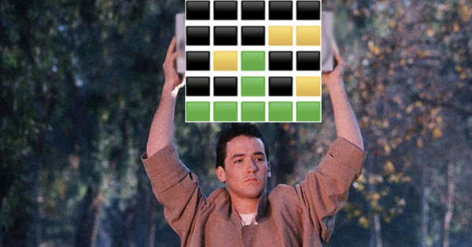
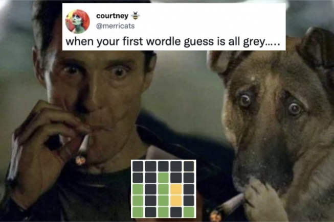

# Wordle

## Overview



If you used social media at all in January, 2022, then you've heard of Wordle.

This a puzzle game involving English words. The rules aren't too complex and can be found [here](https://www.powerlanguage.co.uk/wordle/). Basically, there's a five-letter goal word that you have to figure out, and you get six tries in which to do so, typing in guesses and receiving clues as to how close each guess came.

In the web game, for each guess, each letter will be highlighted one of three ways:
* :green_square: Green: this is a correct letter and in the correct position
* :yellow_square: Yellow: this a correct letter, but in the wrong position
* :black_large_square: Black/Gray: this letter is not in the goal word at all

## This Program

I write this program in Python 3.8. It generates a series of Wordle puzzles that you can either play yourself or allow the program to solve automatically, which it attempts to do without cheating.

If you have Python on your system, then put the source files in some folder. Then...

To play a game yourself:
```
$ python3 wordle.py
```

To let the AI play:
```
$ python3 wordle.py --ai
```

To see other options:
```
$ python3 wordle.py --help
```

## AI Implementation



My thinking about strategy is thus...

On each turn, you have three basic choices:
1. Choose a word that includes letters you haven't tried before.
2. If you have some number of yellow letters, then choose a word that attempts to find the correct positions for them.
3. Try to solve for the final word, putting whatever green letters you've gotten in the correct positions.

As I see it, in early turns, you want the AI to try to eliminate letters that aren't in the final word, not worrying about greens that much, but maybe trying to get yellows into their final place. In the last two turns, you do want to keep your greens in place, filling in the few (hopefully) remaining positions with your best guesses.

Another feature of my implementation is that each word in the lexicon has a "score" assigned to it. The score reflects how common the letters of the word are in the rest of the lexicon. Whenever the AI has a selection of words to try on a given turn, it should prefer the highest scoring one.

In the real game, I would assume the creator has some cleverness to choosing his goal word. However, in this program, one is simply selected at random.

## AI Scoring

   
_Yep, this guy shot down one of his fellow Americans. But, there was a [good reason](https://www.gijobs.com/pilot-shot-down-american-plane/)._

Right now, the performance of my AI heuristic, measured over 5000 games, is:
```
Results:
Total games:     5000
Total victories: 4549
Total defeats:   451
Total errors:    0
% victories      90.98
Average score:   4.002637362637364
```
_(score being average number of turns taken)_

Can you beat this? If you can, I'm curious what your results are and how you did it.

### Sample Game One

```
Guess was: coles. Turn 1 of 6. Strategy: untried letters
Gray letters:   c_l_s
Green letters:  _____
Yellow letters: _o_e_

Guess was: booze. Turn 2 of 6. Strategy: position yellows
Gray letters:   bo_z_
Green letters:  __o_e
Yellow letters: _____

Guess was: drone. Turn 3 of 6. Strategy: hone in
Gray letters:   dr___
Green letters:  __one
Yellow letters: _____

Guess was: atone. Turn 4 of 6. Strategy: hone in
Victory!
```

### Sample Game Two

```
Guess was: bores. Turn 1 of 6. Strategy: untried letters
Gray letters:   bor__
Green letters:  _____
Yellow letters: ___es

Guess was: eases. Turn 2 of 6. Strategy: position yellows
Gray letters:   _a_es
Green letters:  _____
Yellow letters: e_s__

Guess was: chess. Turn 3 of 6. Strategy: position yellows
Gray letters:   ch__s
Green letters:  _____
Yellow letters: __es_

Guess was: sells. Turn 4 of 6. Strategy: position yellows
Gray letters:   __lls
Green letters:  se___
Yellow letters: _____

Guess was: seeds. Turn 5 of 6. Strategy: hone in
Gray letters:   __eds
Green letters:  se___
Yellow letters: _____

Guess was: seeks. Turn 6 of 6. Strategy: hone in
Out of guesses, game over. Defeat! (Word was setup)
```

### Sample Game Three

```
Guess was: cores. Turn 1 of 6. Strategy: untried letters
Gray letters:   _or_s
Green letters:  _____
Yellow letters: c__e_

Guess was: dance. Turn 2 of 6. Strategy: position yellows
Gray letters:   d_n__
Green letters:  ___c_
Yellow letters: _a__e

Guess was: beamy. Turn 3 of 6. Strategy: position yellows
Gray letters:   b__my
Green letters:  _ea__
Yellow letters: _____

Guess was: peace. Turn 4 of 6. Strategy: hone in
Gray letters:   p___e
Green letters:  _eac_
Yellow letters: _____

Guess was: teach. Turn 5 of 6. Strategy: hone in
Victory!
```

_(For more, see [sample output](sample_output_ai.txt) file)_

## Human Gameplay


```
$ python3 wordle.py

Manual:
Enter your word guess or use one of the following commands:
'q' or 'exit': Exit game
'hint': Get a hint
'answer': Show the answer
'nonwords': Allow non-words to be guesses
'words': Only words from the dictionary file can be guesses
'reset' <new word>: Resets the game. If <new word> provided, that becomes the new answer
'help': Show these instructions

Beginning new game
=======================

Guess 1/6
> women
Gray letters:   w_m__
Green letters:  _o_e_
Yellow letters: ____n

Letters left:   a, b, c, d, e, f, g, h, i, j, k, l, n, o, p, q, r, s, t, u, v, x, y, z
Definite:       _o_e_
All yellows:    nnnn_

Guess 2/6
> homes
Gray letters:   h_m_s
Green letters:  _o_e_
Yellow letters: _____

Letters left:   a, b, c, d, e, f, g, i, j, k, l, n, o, p, q, r, t, u, v, x, y, z
Definite:       _o_e_
All yellows:    nnnn_

Guess 3/6
> bones
Gray letters:   b___s
Green letters:  _o_e_
Yellow letters: __n__

Letters left:   a, c, d, e, f, g, i, j, k, l, n, o, p, q, r, t, u, v, x, y, z
Definite:       _o_e_
All yellows:    nn_n_

Guess 4/6
> hint
unplaced: nn_n_
definite: _, o, _, e, _
eliminated: h, s, m, w, b
There are 2 valid choices

Guess 4/6
> novel
Gray letters:   __v_l
Green letters:  no_e_
Yellow letters: _____

Letters left:   a, c, d, e, f, g, i, j, k, n, o, p, q, r, t, u, x, y, z
Definite:       no_e_
All yellows:    

Guess 5/6
> noted
You win!! Yay.
```